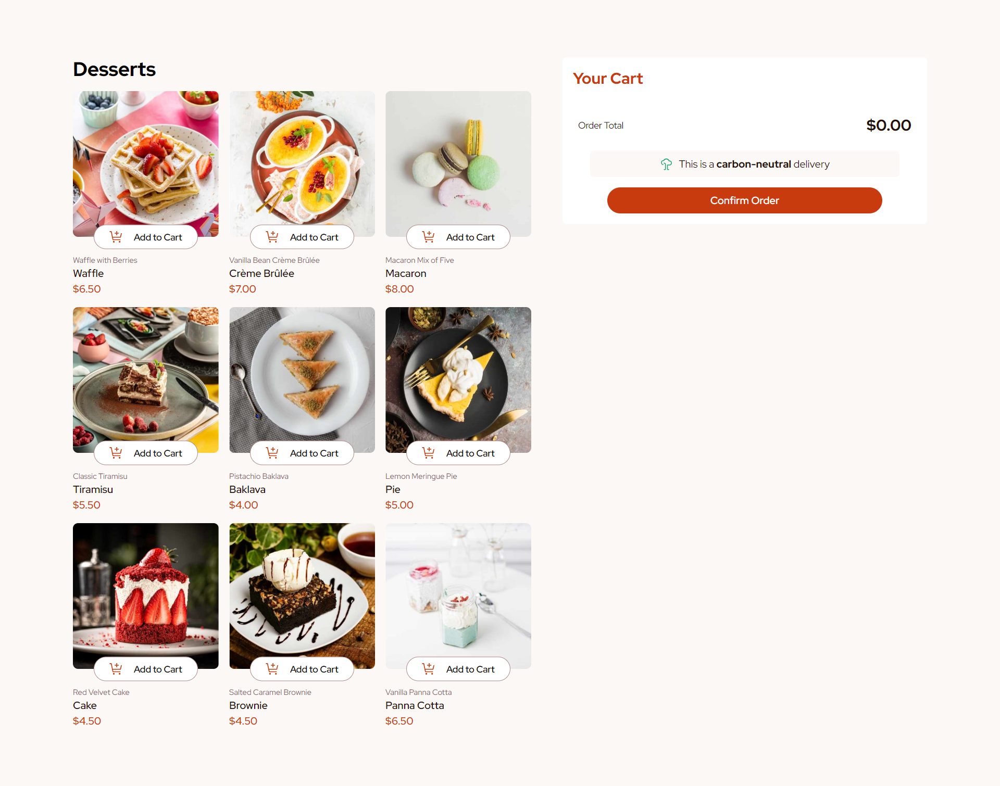

# Frontend Mentor - Product list with cart solution

This is a solution to the [Product list with cart challenge on Frontend Mentor](https://www.frontendmentor.io/challenges/product-list-with-cart-5MmqLVAp_d). Frontend Mentor challenges help you improve your coding skills by building realistic projects.

## Table of contents

- [Overview](#overview)
  - [The challenge](#the-challenge)
  - [Screenshot](#screenshot)
  - [Links](#links)
- [My process](#my-process)
  - [Built with](#built-with)
  - [What I learned](#what-i-learned)
  - [Continued development](#continued-development)
  - [Useful resources](#useful-resources)
- [Author](#author)
- [Acknowledgments](#acknowledgments)

## Overview

### The challenge

Users should be able to:

- Add items to the cart and remove them
- Increase/decrease the number of items in the cart
- See an order confirmation modal when they click "Confirm Order"
- Reset their selections when they click "Start New Order"
- View the optimal layout for the interface depending on their device's screen size
- See hover and focus states for all interactive elements on the page

### Screenshot

### Links

- Solution URL: (https://github.com/donado10/product-list-with-cart)
- Live Site URL: (https://product-list-with-cart-self.vercel.app/)

## My process

### Built with

- Semantic HTML5 markup
- CSS custom properties
- Flexbox
- CSS Grid
- Desktop-first workflow
- [React](https://reactjs.org/) - JS library
- [Typescript](https://www.typescriptlang.org/) - JS with syntax for types.
- [Tailwind](https://tailwindcss.com/) - A utility-first CSS framework

### What I learned

This is my first project in Frontend Mentor. I learned a lot about React by using it with typescript. I was struggling a lot when I used
the Context API for the first time with typescript but it helps me to better graps the essence of modern frontend development. I fall in
love when I used a React design pattern called **COMPOUND COMPONENT**. I learn that it is better to use it when you render card where some of
the cards have different structure. I'm looking foward to do more frontend projects from Frontend mentor because I know for sure I can be
profficient in frontend by doing their challenges.

### Continued development

I still want to focus on the context API and better use it because I think it can enhance the flexibility of maintaining a project and better
managing the states.

### Useful resources

- [How to use the compound component design pattern](https://www.youtube.com/watch?v=vPRdY87_SH0&pp=ygUZY29tcG91bmQgY29tcG9uZW50cyByZWFjdA%3D%3D) - This helped me for using the compound component design pattern. I really liked this pattern and will use it going forward.

## Author

- Frontend Mentor - [@donado10](https://www.frontendmentor.io/profile/donado10)
- Twitter - [@Hey\_\_Ado](https://x.com/Hey__Ado)

## Acknowledgments

I'd like to thanks the frontend mentor team for supporting the Purchasing Power Parity because I'm based in Senegal and it is difficult to match the price offered by
some service providers
